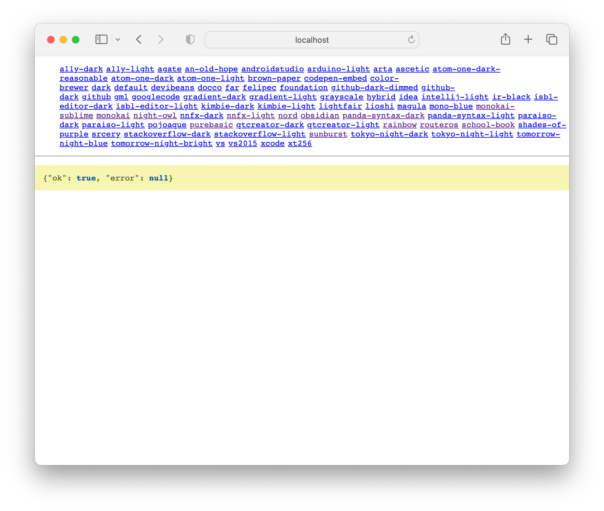

# hylite

A CLI for syntax highlighting code to HTML (...using
[highlight.js](https://www.npmjs.com/package/highlight.js) under the hood).

## To run

### Not installed

```bash
bunx hylite --help
```

Or, if you don't have `bun` installed, with `npx`:

```bash
npx hylite --help
```

### Installed

First install:

```bash
npm install hylite
```

You can either execute it directly:

```bash
./node_modules/.bin/hylite --help
```

Or if you have your `PATH` set, like this:

```bash
export PATH="node_modules/.bin:$PATH"
```

...you'll be able to just type:

```bash
hylite --help
```

## Usage

There are many way to execute the CLI. :

- By `stdin`
- By giving the name of the file
- By a snippet of code

Only when you use a file name/path can it make a good guess of the language.
Otherwise, you'll have to lass the `--language` (or `-l`)  flag.

### By `stdin`

```bash
hylite -l py < mycode.py
```

🎵 This is the same as `cat mycode.py | hyite -l py`

### By giving the name of the file

```bash
hylite myapp.jsx
```

### By a snippet of code

```bash
hylite -l go 'var s string = Acetaminophen.String()'
```

The HTML it produces can be put into a web page, but you probably want
to wrap it in:

```html
<pre>
    <code class="hljs">
        {SNIPPET CODE HERE}
    </code>
</pre>
```

## HTML wrap

`hylite` can take care of that for you with `--wrapped` (or `-w`). For example:

```bash
❯ hylite -l go -w 'var s string = Acetaminophen.String()'
<pre><code class="hljs"><span class="hljs-keyword">var</span> s <span class="hljs-type">string</span> = Acetaminophen.String()</code></pre>
```

## CSS

In its simplest form, to generate the CSS, use:

```bash
hylite -c
```

(or just `hylite --css`)

That will use `highlight.js`'s `default.css` stylesheet. To see what other
themes are available, run:

```bash
hylite --list-css
```

Now, suppose you want `tokyo-night-dark`, go back and run:

```bash
hylite --css tokyo-night-dark
```

If you want to support both light and dark mode in your application, you
have to pick a theme that has both dark and light versions
(see `hylite --list-css`). For example:

```bash
hylite --css tokyo-night-dark
hylite --css tokyo-night-light
```

Copy each one into this CSS template:

```css

/* PUT YOUR LIGHT MODE CSS HERE */

@media only screen and (prefers-color-scheme: dark) {

    /* PUT YOUR DARK MODE CSS HERE */

}
```

### Preview server

If you want to see what all the different styles look like, you need to
use `bun`. Example:

```bash
❯ hylite -p health.json
Now open http://localhost:3000
```

It will display your `health.json` file but at the top of the page you
can click and select the different possible themes.



## To develop

You must use [Bun](https://bun.sh) to test locally. The most basic form
is using `bun run src/index.ts`.

### First install

If you have cloned the repo, you just need to run:

```bash
bun install
```

...to install the dependencies.

To run:

```bash
bun run src/index.ts --help
```

### Tests

```bash
bun test [--watch]
```

But note that the GitHub Actions workflows do more things with the build
artifact `dist/index.js`. To generate the `dist/index.js`, use:

```bash
bun run build
```

The Node end-to-end test suite uses this `dist/index.js` execlusively.
At the moment (Sept 2023), with `bun` 1.0.2, it appears that generating
the `dist/index.js` is potentially different depending on the platform.

### To release

Run:

```bash
bun run release
```

This will execute `bun run build` and if that `dist/index.js` becomes
different, the release process is halted.

## Caveats and goals

### Standalone executable

I hope some day to use `bun build` to compile a standalone executable
that is portable to any OS. Then this CLI can be shipped in the likes
of Debian sources or Homebrew. At the moment, the build artifact works
but only on macOS (where I'm testing this):

```bash
❯ bun build --compile --outfile hylite-executable src/index.ts
  [24ms]  bundle  205 modules
 [222ms] compile  hylite-executable
 ...

❯ ls -lh hylite-executable
-rwxrwxrwx  1 peterbe  staff    55M Sep 24 14:47 hylite-executable

❯ ./hylite-executable /tmp/throwaway/health.json
<span class="hljs-punctuation">{</span><span class="hljs-attr">&quot;ok&quot;</span><span class="hljs-punctuation">:</span> <span class="hljs-literal"><span class="hljs-keyword">true</span></span><span class="hljs-punctuation">,</span> <span class="hljs-attr">&quot;error&quot;</span><span class="hljs-punctuation">:</span> <span class="hljs-literal"><span class="hljs-keyword">null</span></span><span class="hljs-punctuation">}</span>
```

### API

At the moment, `hylite` only exists as a CLI. If you want to execute it
as an install dependency API, this is currently not supported. Technically,
`hylite` is a client of [`highlight.js`](https://highlightjs.org/#usage).

But let's chat if you can think this would be useful. All we need to
do is rearrange the code in `src/index.ts` a bit so that its core is
plucked out into its own ESM exported function. The `src/index.ts`
could be just the CLI part.

### Guessing the syntax

When you run `hylite myfile.rb` it can deduce the Ruby language from the
file extension. But if you use `cat myfile.rb | hylite` it can't know the
language so you have to use `cat myfile.rb | hylite -l rb`.

But `highlight.js` has a decent API for guessing called `hljs.highlightAuto`
which could be used. Let me know if you want to help out add this
functionality.

## Benchmarking

You need Bun to hack on this project, but once the built artifact
is ready (`dist/index.js`) you can use either `node` or `bun run` to
execute it. This is how and why you can interchange using `npx` or `bunx`
from outside the repo. At this point, the strengths of `bun` are less
advantageous because it's now mostly a matter of starting up.

Using [`hyperfine`](https://github.com/sharkdp/hyperfine) to compare:

```bash
❯ hyperfine 'node dist/index.js src/index.ts' 'bun run dist/index.js src/index.ts'
Benchmark 1: node dist/index.js src/index.ts
  Time (mean ± σ):     173.5 ms ±  21.1 ms    [User: 152.2 ms, System: 20.6 ms]
  Range (min … max):   155.8 ms … 227.3 ms    17 runs

Benchmark 2: bun run dist/index.js src/index.ts
  Time (mean ± σ):     167.0 ms ±   2.9 ms    [User: 180.8 ms, System: 31.8 ms]
  Range (min … max):   161.8 ms … 173.5 ms    17 runs

Summary
  bun run dist/index.js src/index.ts ran
    1.04 ± 0.13 times faster than node dist/index.js src/index.ts
```

In conclusion; **no speed difference**.

If you run `npx` or `bunx`, the first time both of them would depend on
network to download the code to the global cache. But if you run them
at least once and compare, again with [`hyperfine`](https://github.com/sharkdp/hyperfine):

```bash
❯ hyperfine 'npx hylite huey_health.json' 'bunx hylite huey_health.json'
Benchmark 1: npx hylite huey_health.json
  Time (mean ± σ):      1.184 s ±  0.107 s    [User: 1.093 s, System: 0.272 s]
  Range (min … max):    1.102 s …  1.452 s    10 runs

Benchmark 2: bunx hylite huey_health.json
  Time (mean ± σ):     159.9 ms ±   3.6 ms    [User: 145.7 ms, System: 30.4 ms]
  Range (min … max):   154.8 ms … 168.1 ms    17 runs

Summary
  bunx hylite huey_health.json ran
    7.40 ± 0.69 times faster than npx hylite huey_health.json
```

In conclusion; **`bunx` is 7 times faster than `npx`.
